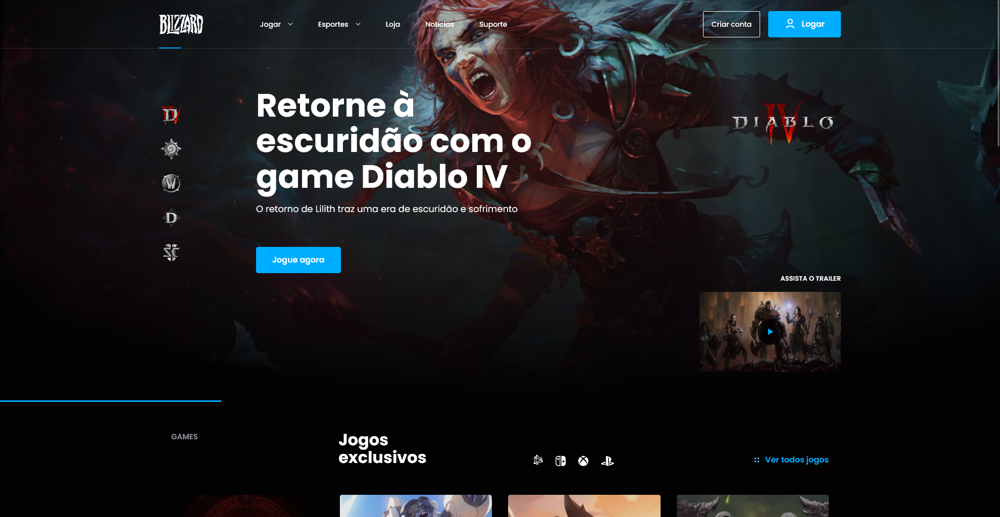
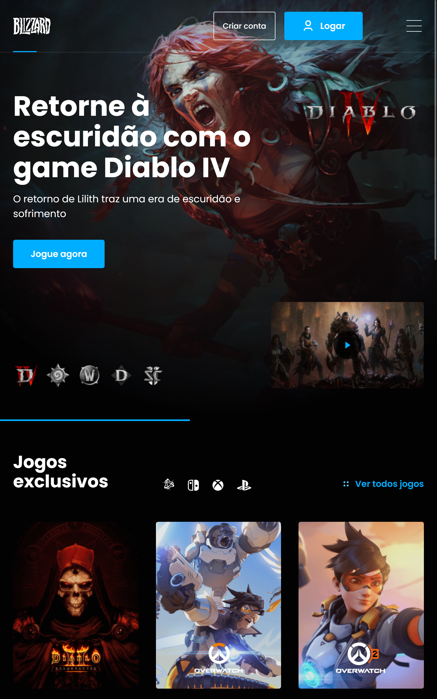
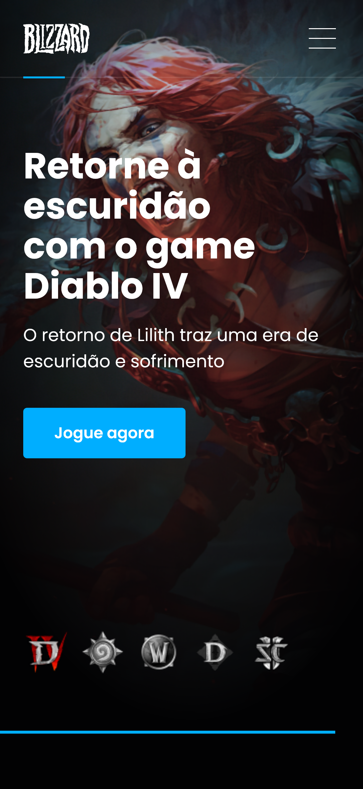

# Blizzard UI

## 📝 Sobre o projeto
Este projeto se trata da realização de um desafio proposto pela plataforma [BRChallenges](https://www.brchallenges.com/desafio/blizzard). Ela consiste na criação de um site temática sobre a empresa Blizzard baseado no [Layout proposto](https://www.figma.com/file/mlAXZPRMfibrGXkJmUz5yn/BR-Challenges).

## ✍️ Descrição do desafio
O tema é uma landing page da empresa blizzard, nessa página o dev deverá construir um menu de navegação, a seção banner hero com a funcionalidade de alterar o jogo destaque(Diablo, HearthStone e World of Warcraft), a listagem dos principais jogos da empresa e um rodapé contendo informações sobre o download do app battle.net.

## ⚛️ Tecnologias utilizadas
- ReactJS
- Typescript
- Styled-Components
- React Testing Library

## 💽 Como rodar o projeto
para iniciar o projeto localmente realize um clone do repositório:
```
git clone https://github.com/JeanLuca999/blizzard-ui.git
```

Para instalar as dependências do projeto:
```
npm install
```

Para iniciar o projeto localmente:
```
npm start
```

## 💻 Preview do projeto

### Large Desktop


### Desktop


### Tablet


### Mobile
